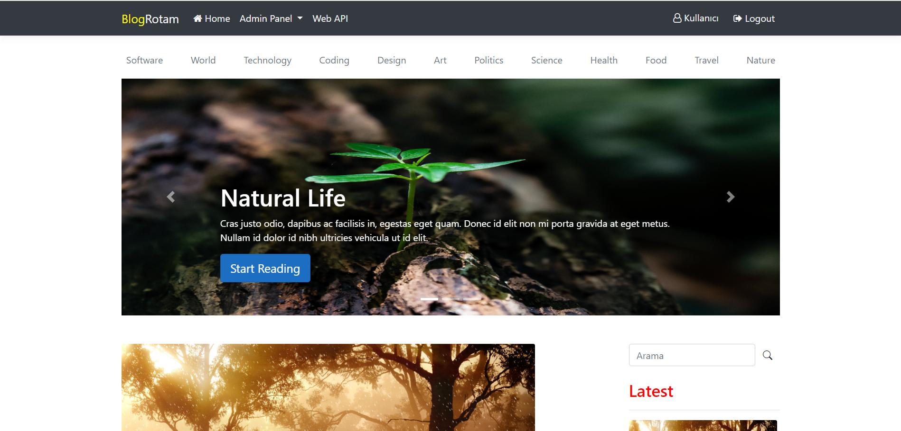
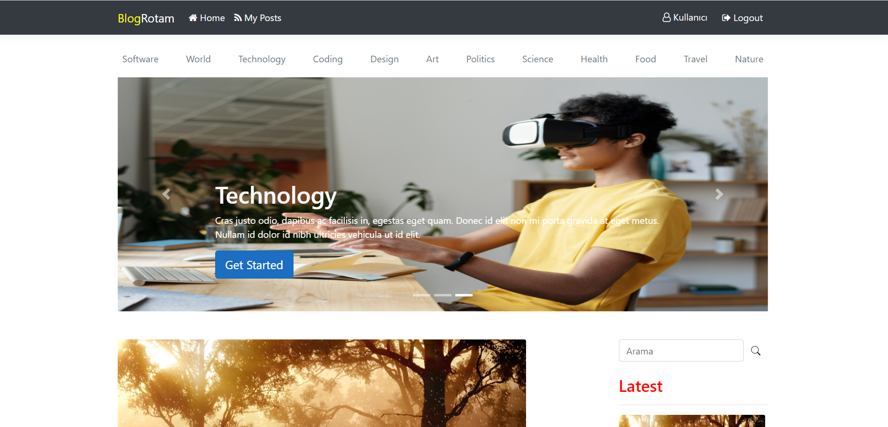
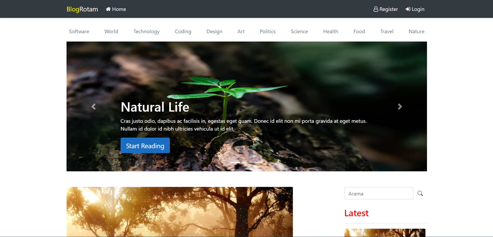
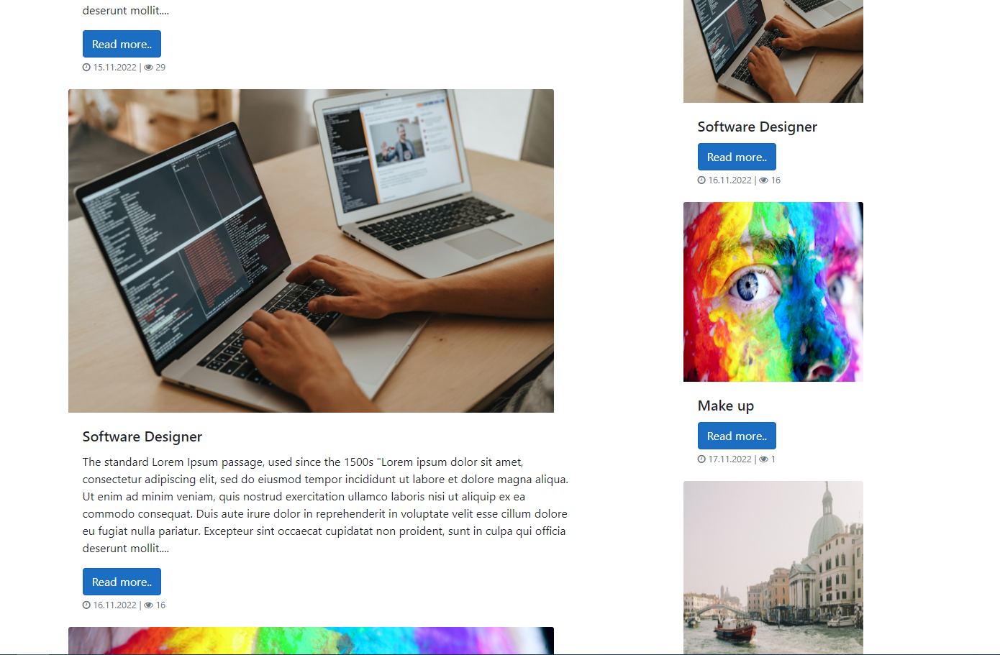
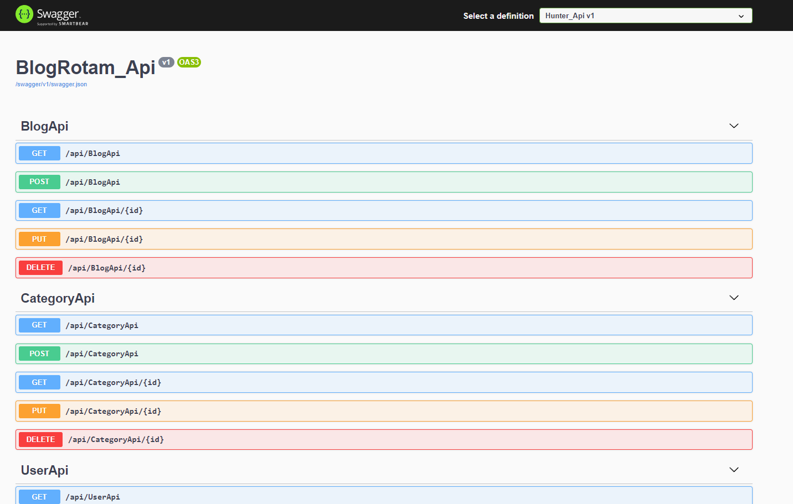

 # BlogRotam 
> ### This repository is created for Rotamopt project delivery.

## Used Tech

| Design | Tech      |
| ---    | ---       |
| Framework | Visual Studio Community 2022 v17.2.0 - ASP .NET Core Web App MVC 5.0 |
| Front-End | HTML5 - Bootstrap - Fontawesome |
| Back-End  | C# |
| Database  | Microsoft SQL Server Management Studio 2022  v18.11.1     |
| REST API  | Swagger  |
| Identity  | Microsoft Identity |
| Dev       | Facebook developer & Google Console Developer |

## Development Setup
### Prerequisites
> *  <a href="https://dotnet.microsoft.com/en-us/download/dotnet/5.0" >.NET SDK </a> v5.0
> *  <a href="https://visualstudio.microsoft.com/tr/vs/" >Visual Studio </a> Community 2022 
> *  <a href="https://info.microsoft.com/ww-landing-sql-server-2022.html?lcid=tr-tr">SQL Server</a> 2022

## Packages

| Package | Link |
|---|---|
| Microsoft.EntityFrameworkCore.Tools 5.0.17               | [@Entity.FrameworkCore.Tools](https://www.nuget.org/packages/Microsoft.EntityFrameworkCore.Tools/5.0.17) | 
| Microsoft.EntityFrameworkCore.SqlServer 5.0.17   | [@Entity.FrameworkCore.SqlServer](https://www.nuget.org/packages/Microsoft.EntityFrameworkCore.SqlServer/5.0.17) | 
| Microsoft.AspNetCore.Diagnostics.EntityFrameworkCore 5.0.16 |[@AspNetCore.Diagnostics.EntityFrameworkCore](https://www.nuget.org/packages/Microsoft.AspNetCore.Diagnostics.EntityFrameworkCore/5.0.16) | 
| Microsoft.AspNetCore.Identity.EntityFrameworkCore 5.0.17 |[@Identity.EntityFrameworkCore](https://www.nuget.org/packages/Microsoft.AspNetCore.Identity.EntityFrameworkCore/5.0.17) | 
| Microsoft.AspNetCore.Identity.UI 5.0.17               | [@Identity.UI ](https://www.nuget.org/packages/Microsoft.AspNetCore.Identity.UI/5.0.17) | 
| Microsoft.AspNetCore.Mvc.Razor.RuntimeCompilation 5.0.16 | [@Mvc.Razor.RuntimeCompilation](https://www.nuget.org/packages/Microsoft.AspNetCore.Mvc.Razor.RuntimeCompilation/5.0.16) |
| Microsoft.VisualStudio.Azure.Containers.Tools.Targets 1.15.1 | [@Azure.Containers.Tools.Targets](https://www.nuget.org/packages/Microsoft.VisualStudio.Azure.Containers.Tools.Targets/1.15.1) |
| Microsoft.VisualStudio.Web.CodeGeneration.Design 5.0.2 | [@Web.CodeGeneration.Design](https://www.nuget.org/packages/Microsoft.VisualStudio.Web.CodeGeneration.Design/5.0.2) |
| Swashbuckle.AspNetCore.SwaggerGen 5.6.1 | [@SwaggerGen](https://www.nuget.org/packages/Swashbuckle.AspNetCore.SwaggerGen/5.6.1) |
| Swashbuckle.AspNetCore.SwaggerUI  5.6.1 | [@SwaggerUI](https://www.nuget.org/packages/Swashbuckle.AspNetCore.SwaggerUI/5.6.1) |
| Swashbuckle.AspNetCore.Swagger 5.6.1    | [@Swagger](https://www.nuget.org/packages/Swashbuckle.AspNetCore.Swagger/5.6.1) |
| Microsoft.AspNetCore.Authentication.Facebook 5.0.2 | [@Facebook](https://www.nuget.org/packages/Microsoft.AspNetCore.Authentication.Facebook/5.0.12) |
| Microsoft.AspNetCore.Authentication.Google 5.0.12 | [@Google](https://www.nuget.org/packages/Microsoft.AspNetCore.Authentication.Google/5.0.12) |
| X.PagedList.Mvc.Core 8.4.3 | [@Pagging](https://www.nuget.org/packages/X.PagedList.Mvc.Core/8.4.3) |

## Website Login
##### for Admin 
> * Email:asda@asda.com
> * Password:User123*

## Login Admin

## Login User

## Login Default 

## Rest Api 

